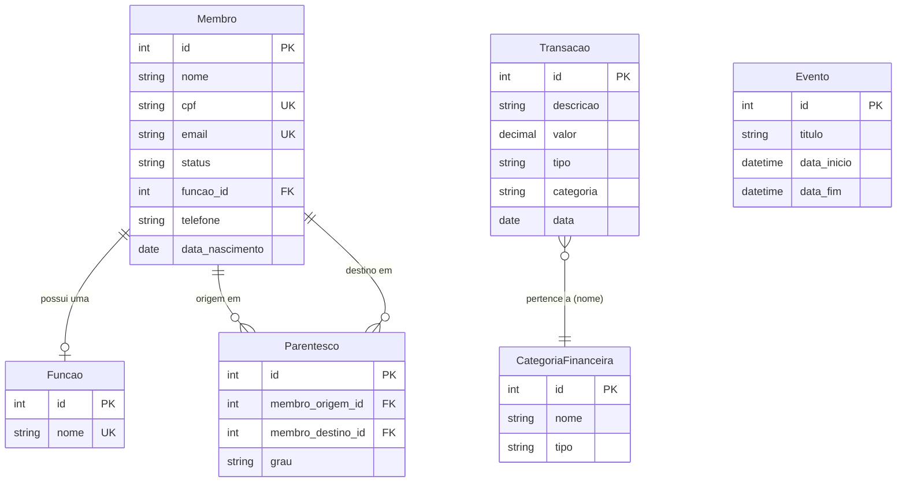

# 🏛️ Manual de Arquitetura - AD Capital

Este documento consolida todos os serviços e endereços que compõem o ecossistema digital da igreja.

### 📍 Localização dos Serviços

| Serviço | Provedor | Função | Acesso |
| :--- | :--- | :--- | :--- |
| **Domínio** | Registro.br | "Dono" do nome | [registro.br](https://registro.br) |
| **DNS & Segurança** | Cloudflare | "Torre de Comando" e Redirecionamentos | [dash.cloudflare.com](https://dash.cloudflare.com) |
| **Site/Sistema (Front)** | Render | Onde o visual do site funciona | [dashboard.render.com](https://dashboard.render.com) |
| **Banco/API (Back)** | Supabase | Onde os dados dos membros ficam permanentemente | [supabase.com](https://supabase.com) |
| **Fotos & Mídia** | Cloudinary | Armazena fotos dos membros e logos | [cloudinary.com](https://cloudinary.com) |
| **Código Fonte** | GitHub | Onde todo o código do projeto é salvo | [github.com](https://github.com) |

### 🔗 Estrutura de Endereços (URLs)

| URL | Finalidade | Quem Acessa |
| :--- | :--- | :--- |
| `adcapitaligreja.com.br` | **Site Institucional** (Público) | Visitantes / Google |
| `sistema.adcapitaligreja.com.br` | **Painel Administrativo** | Secretários / Pastores |
| `cadastro.adcapitaligreja.com.br` | **Portal de Membros** | Novos Membros |
| `api.adcapitaligreja.com.br/admin` | **Django Admin (Manual)** | Superusuário / TI |
| `api.adcapitaligreja.com.br` | **Comunicação Interna** (Backend) | Invisível ao usuário |

---

### 🛠️ Fluxo de Funcionamento

1. **Desenvolvimento**: As alterações são feitas localmente.
2. **GitHub**: O código é enviado para o repositório seguro.
3. **Render**: Detecta a mudança no GitHub e atualiza o site automaticamente em minutos.
4. **Cloudflare**: Protege o site contra ataques e redireciona os domínios para os lugares certos.
5. **Cloudinary**: Garante que as fotos dos membros nunca sumam, mesmo que o servidor seja reiniciado.

---

### 🏛️ Modelo de Entidade-Relacionamento (MER)

Abaixo está o diagrama das principais tabelas que compõem o banco de dados no Supabase:



---

### 💾 Backup e Segurança de Dados

Para garantir que a igreja nunca perca seus dados, existe um script de exportação rápida que gera um arquivo formatado (JSON).

**Como realizar o backup:**
1. Abra o terminal na pasta raiz do projeto.
2. Execute o comando:
   ```powershell
   .\venv\Scripts\python.exe fast_backup.py
   ```
3. Um novo arquivo **`backup_adcapital.json`** será gerado.
4. **Recomendação**: Salve uma cópia deste arquivo em um local seguro (Google Drive, Pen Drive, etc) toda semana.

---
*Manual de arquitetura - AD Capital Igreja*
