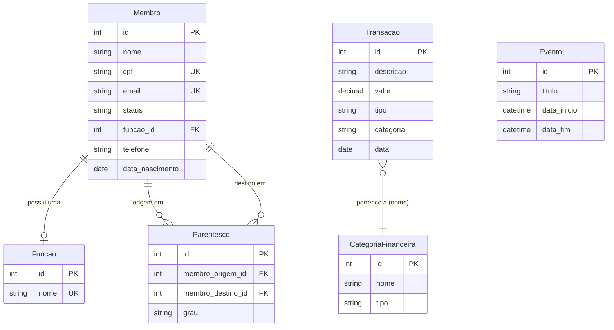

# 🏛️ Manual de Arquitetura - AD Capital

Este documento consolida todos os serviços e endereços que compõem o ecossistema digital da igreja.

### 📍 Localização dos Serviços

| Serviço | Provedor | Função | Acesso |
| :--- | :--- | :--- | :--- |
| **Domínio** | Registro.br | "Dono" do nome | [registro.br](https://registro.br) |
| **DNS & Segurança** | Cloudflare | "Torre de Comando" e Redirecionamentos | [dash.cloudflare.com](https://dash.cloudflare.com) |
| **Site/Sistema (Front)** | Render | Onde o visual do site funciona | [dashboard.render.com](https://dashboard.render.com) |
| **Banco/API (Back)** | Supabase | Onde os dados dos membros ficam permanentemente | [supabase.com](https://supabase.com) |
| **Fotos & Mídia** | Cloudinary | Armazena fotos dos membros e logos | [cloudinary.com](https://cloudinary.com) |
| **Código Fonte** | GitHub | Onde todo o código do projeto é salvo | [github.com](https://github.com) |
| **CI / Backup** | GitHub Actions | Testes, build e backup diário | Ver `docs/OPERACAO-FASE-4.md` |
| **Estatísticas & BI** | Google | Monitoramento e conversões do site e portal | [analytics.google.com](https://analytics.google.com) |

### 🔗 Estrutura de Endereços (URLs)

| URL | Finalidade | Quem Acessa |
| :--- | :--- | :--- |
| `adcapitaligreja.com.br` | **Site Institucional** (Público) | Visitantes / Google |
| `sistema.adcapitaligreja.com.br` | **Sistema** (login e painéis) | Pastoral e membros |
| `sistema.adcapitaligreja.com.br/login` | **Login** (JWT) | Pastoral / membros |
| `sistema.adcapitaligreja.com.br/admin/inicio` | **Painel administrativo** | ADMIN, SECRETARIO, TESOUREIRO |
| `sistema.adcapitaligreja.com.br/portal/mensagens` | **Portal do membro** | MEMBRO |
| `sistema.adcapitaligreja.com.br/#/cadastro` | **Auto-cadastro público** (quando portal ativo) | Novos membros |
| `api.adcapitaligreja.com.br/api/v1/` | **API REST versionada** (contrato estável) | Front, cron, futuro app mobile |
| `api.adcapitaligreja.com.br/api/` | **API legado** (depreciada; sunset Dez/2026) | Evitar em clientes novos |
| `api.adcapitaligreja.com.br/api/v1/docs/` | **Swagger UI** (OpenAPI) | TI / desenvolvimento |
| `api.adcapitaligreja.com.br/api/v1/schema/` | **Esquema OpenAPI 3** | TI / integrações |
| `api.adcapitaligreja.com.br/admin` | **Django Admin** (manual) | Superusuário / TI |

**Compatibilidade:** links antigos com hash (`#/admin`, `#/portal`, `#/cadastro`) redirecionam automaticamente para as rotas acima.

---

### 🛠️ Fluxo de Funcionamento

1. **Desenvolvimento**: As alterações são feitas localmente.
2. **GitHub**: O código é enviado para o repositório seguro (`igrejaadcapital/adcapital`, branch `main`).
3. **Render**: Detecta o push na `main` e faz deploy automático da API (`adcapital-api`) e do front (`adcapital-web`).
4. **Cloudflare**: Protege o site contra ataques e redireciona os domínios para os lugares certos.
5. **Cloudinary**: Garante que as fotos dos membros nunca sumam, mesmo que o servidor seja reiniciado.

### 📦 Repositório e serviços Render

| Componente | Pasta / serviço | Deploy |
| :--- | :--- | :--- |
| Backend | Raiz do repo → **adcapital-api** (Web Service) | `build.sh`: pip, migrate, `createcachetable`, collectstatic |
| Frontend | **adcapital-react/** → **adcapital-web** (Static Site) | `npm run build` → `dist/`; `public/_redirects` envia `/*` → `index.html` (SPA) |
| Banco | Supabase PostgreSQL (`DATABASE_URL`) | Sem deploy separado |

### 🧩 Fase 1 — Organização do código (em produção)

**Backend (Django)**

- `membros/api/` — views por domínio (auth, público, admin, portal, cron, usuários, configuração).
- `membros/services/` — regras de negócio (cadastro, parentesco, keep-alive).
- `membros/views.py` — reexportações (compatibilidade).
- `adcapitalcore/api_urls.py` — rotas REST compartilhadas.
- `adcapitalcore/api_v1_urls.py` — prefixo `/api/v1/` + OpenAPI (`schema`, `docs`, `redoc`).

**Frontend (React 19)**

- `adcapital-react/src/routes/` — React Router 7, layouts admin/portal, guards por papel.
- `adcapital-react/src/main.jsx` — **`BrowserRouter` em dev**, **`HashRouter` em produção** (`/#/admin/...`); o host só precisa servir `index.html` na raiz.
- `paths.js` — constantes de URL (base para app mobile).
- Navegação compartilhável em dev; em produção o hash evita 404 em refresh em hosts estáticos (Render, Capacitor).

**Dependência nova:** `drf-spectacular` (documentação OpenAPI). Sem migrações de banco na Fase 1.

### 📋 Roadmap de fases (resumo)

| Fase | Foco | Status |
|------|------|--------|
| **0** | Segurança (CORS, RBAC, JWT, cron) | Concluída |
| **1** | API v1, OpenAPI, React Router, modularização `membros` | Concluída |
| **2** | TanStack Query, `features/`, UX mobile | Concluída |
| **3** | PWA + Capacitor Android | Concluída |
| **4** | CI, staging, Sentry, backup automático | Concluída |
| **5** | Qualidade: DRF público, HSTS, ESLint, LGPD autocomplete | Concluída |
| **6** | Refatoração front, TS gradual, JWT httpOnly, handoff | Concluída |

Detalhes: `docs/PLANO-REFATORACAO.md`, `docs/FASE-5-QUALIDADE.md`, `docs/FASE-6-EVOLUCAO.md`.

### ✅ Fases 5–6 — Melhorias em produção (2026)

**Cadastro e LGPD**

- Cadastro pelo **admin** (`MembroViewSet`) chama `garantir_acesso_membro()` e `provisionar_termo_lgpd()` ao salvar.
- Cadastro **público** unificado no DRF (`AutoCadastroMembroView`, `/api/v1/c/`).
- Busca de parentes no auto-cadastro exige `portal_token` (após pergunta de segurança) — ver `membros/services/portal_token_service.py`.
- Termo LGPD em branco para impressão: `GET /api/v1/membros/termo-lgpd-em-branco/`.
- Restauração de membro excluído: `python manage.py restaurar_membro --cpf ...`.

**Qualidade e operação**

- CI: `pytest` com cobertura mínima 35%, `vitest`, `eslint src`, `npm run build`.
- Comando de auditoria: `python manage.py auditar_acesso_lgpd`.
- Prefixo legado `/api/` retorna header `Deprecation` (middleware em `adcapitalcore/middleware.py`).
- App legado `adcapitalapp/` **removido** do repositório (Fase 5).
- `staticfiles/` fora do versionamento Git.

**Frontend**

- `SettingsPage` e `LandingPage` divididos em módulos (`settings/`, `landing/sections/`).
- TypeScript inicial: `src/config/apiBase.ts`, `src/api/queryClient.ts`.
- `HashRouter` em produção; `BrowserRouter` em dev (`main.jsx`).

**Pendências conhecidas**

| Item | Ação |
|------|------|
| Remover `/api/` legado | Após Dez/2026 |
| App iOS (App Store) | PWA Safari hoje — ver `docs/MOBILE-IOS.md` |

### 🔄 Rollback de produção

| Item | Valor |
| :--- | :--- |
| Tag Git | `prod-pre-fase1-20260522` |
| Commit anterior à Fase 1 | `def497c` |
| Merge da Fase 1 na `main` | `451339c` (PR #2) |

**Render (rápido):** Manual Deploy no commit/tag acima em **adcapital-api** e **adcapital-web**.

**Git:** `git revert -m 1 451339c` na `main` e push (Render redeploya).

**Front temporário:** `VITE_API_URL=https://api.adcapitaligreja.com.br/api` (legado ainda suportado).

Detalhes: `docs/ROLLBACK-FASE-1.md`.

---

### 🏛️ Modelo de Entidade-Relacionamento (MER)

Abaixo está o diagrama das principais tabelas que compõem o banco de dados no Supabase:


```mermaid
erDiagram
    Membro ||--o| Funcao : "possui uma"
    Membro ||--o{ Parentesco : "origem em"
    Membro ||--o{ Parentesco : "destino em"
    Transacao }o--|| CategoriaFinanceira : "pertence a (nome)"
    
    Membro {
        int id PK
        string nome
        string cpf UK
        string email UK
        string status
        int funcao_id FK
        string telefone
        date data_nascimento
    }
    
    Funcao {
        int id PK
        string nome UK
    }
    
    Parentesco {
        int id PK
        int membro_origem_id FK
        int membro_destino_id FK
        string grau
    }
    
    Transacao {
        int id PK
        string descricao
        decimal valor
        string tipo
        string categoria
        date data
    }

    CategoriaFinanceira {
        int id PK
        string nome
        string tipo
    }

    Evento {
        int id PK
        string titulo
        datetime data_inicio
        datetime data_fim
    }
```

---

### 🔐 Gestão de Acessos (RBAC)

O sistema implementa um controle de acesso rigoroso baseado em cargos:

| Nível de Acesso | Permissões Principais |
| :--- | :--- |
| **ADMIN** | Controle total do sistema, configurações e gestão de usuários. |
| **SECRETARIO** | Gestão completa de membros, geração de documentos (LGPD) e agenda. |
| **TESOUREIRO** | Gestão financeira, entradas/saídas e relatórios de caixa. |
| **MEMBRO** | Acesso exclusivo ao seu próprio perfil para atualização de dados cadastrais. |

**Segurança:** Rotas administrativas usam **JWT** com access token de **30 minutos** e refresh de **7 dias** (rotação com blacklist). Papéis (`ADMIN`, `SECRETARIO`, `TESOUREIRO`, `MEMBRO`) controlam o que cada usuário pode ver na API.

**Variáveis obrigatórias em produção (Render):**
| Variável | Uso |
| :--- | :--- |
| `SECRET_KEY` | Chave Django forte (não usar o valor `django-insecure-...`) |
| `CRON_SECRET` | Header `X-Cron-Secret` no cron de aniversários (`/api/v1/verificar-aniversarios/` ou legado `/api/...`) |
| `DEBUG` | Deve ser `False` em produção |
| `VITE_API_URL` | **adcapital-web:** base da API no front (produção: `https://api.adcapitaligreja.com.br/api/v1`) |
| `VITE_GA_MEASUREMENT_ID` | ID do Google Analytics 4 no React |

---

### 👤 Portal do Membro (Auto-serviço)

Uma das maiores inovações do sistema é o portal onde o próprio membro gerencia sua ficha:
*   **Acesso Simplificado:** Login via CPF (só dígitos) e senha pessoal.
*   **Senha padrão** (novos acessos): `Adcapital` + 5 primeiros dígitos do CPF (ex.: CPF `01561969648` → `Adcapital01561`).
*   **Atualização em Tempo Real:** O membro pode corrigir telefone, e-mail, endereço e cargo eclesiástico.
*   **Transparência:** Visualização de vínculos familiares e status de regularidade.

**Provisionamento automático (admin e público)**

| Momento | Login (`User`) | Termo LGPD (PDF) |
|---------|----------------|------------------|
| Cadastro pelo admin | `garantir_acesso_membro()` no save | `provisionar_termo_lgpd()` se ainda não houver arquivo |
| Auto-cadastro público | `finalizar_cadastro_publico()` | PDF gerado + e-mail em background (se houver e-mail) |

**Auditoria periódica** (recomendado após cadastros em lote):

```powershell
python manage.py auditar_acesso_lgpd
python manage.py gerar_acessos_membros   # se houver sem login
python manage.py gerar_termos_lgpd         # se houver sem PDF
```

---

### ⏰ Keep-Alive (Prevenção de Inatividade)

Devido às limitações dos planos gratuitos utilizados:
1. **Render Free (API)**: Entra em modo de suspensão (*sleep*) após 15 minutos sem receber requisições, causando lentidão (*cold start*) no próximo acesso.
2. **Supabase Free (Banco de Dados)**: Pausa o projeto inteiro após 7 dias ininterruptos de inatividade.

**Solução Aplicada:**
1. **Self-ping na API** (`membros/services/keep_alive.py`): ping em `/api/ping/` no horário ativo; **stand-by 23h–6h (Brasília)** para economizar horas do Render Free.
2. **[cron-job.org](https://cron-job.org/en/)** (use `/api/v1/`):
   - **Keep-alive** (ex.: a cada 30 min, **só 6h–23h**): `GET https://api.adcapitaligreja.com.br/api/v1/configuracao-site/`
   - **Aniversários** (diário, ex. 08h): `GET .../api/v1/verificar-aniversarios/` com header `X-Cron-Secret: <CRON_SECRET no Render>`

Variáveis no Render (`adcapital-api`): `KEEP_ALIVE_QUIET_START=23`, `KEEP_ALIVE_QUIET_END=6`, `KEEP_ALIVE_TIMEZONE=America/Sao_Paulo`, `KEEP_ALIVE_INTERVAL_SECONDS=1800`.

Detalhes: `docs/ALERTAS-INFRA.md`.

---

### 💾 Backup e Segurança de Dados

Para garantir que a igreja nunca perca seus dados, existe um script de exportação rápida que gera um arquivo formatado (JSON).

**Como realizar o backup:**
1. Abra o terminal na pasta raiz do projeto.
2. Execute o comando:
   ```powershell
   .\venv\Scripts\python.exe fast_backup.py
   ```
3. Um novo arquivo **`backup_adcapital.json`** será gerado.
4. **Recomendação**: Salve uma cópia deste arquivo em um local seguro (Google Drive, Pen Drive, etc) toda semana.

---

### 📊 Estatísticas e Rastreamento (Google Analytics 4)

O ecossistema digital possui uma integração robusta e customizada com o **Google Analytics 4 (GA4)** para rastrear o fluxo de visitas e interações cruciais.

**O que é monitorado:**
*   **Landing Page Pública**: Acessos à página inicial (`/`) e cliques de conversão no botão *"Portal do Membro"* no cabeçalho.
*   **Portal do Membro (Logado)**: Navegação interna pelas abas (Mensagens: `/portal/mensagens`, Agenda: `/portal/agenda`, Perfil: `/portal/perfil`).
*   **Painel Administrativo**: Acessos ao login (`/login`) e navegação pelas abas administrativas (Início, Membros, Financeiro, Agenda, Estatísticas, Configurações).
*   **Rastreamento interno (API)**: `POST /api/v1/analytics/track/` (ou `/api/analytics/track/`) registra visitas ao site (`SITE`) e ao portal (`PORTAL`) na tabela `analytics.Acesso`.

**Configuração de Produção:**
O ID de métrica é configurado de forma dinâmica no frontend via variável de ambiente:
*   `VITE_GA_MEASUREMENT_ID` (ID de Produção: `G-7KZ3C5J6TH`)

Para alterar a conta de recebimento, basta atualizar essa chave no painel do Render (**adcapital-web**) ou no `.env` do React.

### 🧪 Validação pós-deploy

```powershell
.\venv\Scripts\python.exe scripts\smoke_producao.py
# ou
.\venv\Scripts\python.exe manage.py smoke_fase0
```

Confere ping/health em `/api/v1/`, legado `/api/`, login JWT, RBAC e frontends públicos.

**Subdomínio legado:** `cadastro.adcapitaligreja.com.br` foi **descontinuado** (jun/2026). Use `sistema…/#/cadastro`. Ver `docs/DEPRECACAO-CADASTRO-SUBDOMINIO.md`.

### 🔄 Como retornar ao projeto (handoff)

Use este roteiro quando **outro desenvolvedor**, **nova assinatura de IA** (Cursor, Copilot, etc.) ou **você mesmo após meses** for retomar o código. Não depende de conversas antigas — tudo está no GitHub.

#### 1. Onde está o código

| Item | Valor |
|------|-------|
| Repositório | [github.com/igrejaadcapital/adcapital](https://github.com/igrejaadcapital/adcapital) |
| Branch produção | `main` |
| Clone | `git clone https://github.com/igrejaadcapital/adcapital.git` |

#### 2. O que ler primeiro (ordem)

| Ordem | Arquivo | Conteúdo |
|-------|---------|----------|
| 1 | **`AGENTS.md`** | Regras para IA/dev: API v1, cookies, testes, o que não fazer |
| 2 | **`docs/HANDOFF.md`** | Avaliação completa: pronto vs lacunas, emergências |
| 3 | **`ARQUITETURA.md`** | Este manual (infra, URLs, RBAC, backup) |
| 4 | **`docs/CONTA-E-SECRETS.template.md`** | Template de contas — **preencher offline**, nunca commitar senhas |
| 5 | **`docs/DEPLOY-API-RENDER.md`** | API no Render (fora do `render.yaml`) |

Índice geral: `docs/README.md`. Wiki no sistema: **Configurações → Wiki**.

#### 3. Ambiente local (Windows)

```powershell
cd adcapital
python -m venv venv
.\venv\Scripts\activate
pip install -r requirements.txt -r requirements-dev.txt
copy .env.example .env          # preencher DATABASE_URL, SECRET_KEY, etc.
$env:DEBUG='True'               # obrigatório se SECRET_KEY de dev
python manage.py migrate
python manage.py runserver

# Outro terminal — frontend
cd adcapital-react
npm ci
npm run dev                     # http://localhost:5173
```

#### 4. Validar antes de alterar

```powershell
pytest
cd adcapital-react && npm test && npm run lint
```

#### 5. Prompt sugerido para nova IA

> Leia `AGENTS.md`, `docs/HANDOFF.md` e `ARQUITETURA.md`. Depois execute a tarefa: [descreva aqui].

#### 6. Deploy e validação em produção

1. Commit na `main` (ou PR merge) → Render redeploya **adcapital-api** e **adcapital-web** automaticamente.
2. Após o deploy:

```powershell
.\venv\Scripts\python.exe scripts\smoke_producao.py
```

#### 7. Comandos operacionais frequentes

| Situação | Comando |
|----------|---------|
| Auditoria login + LGPD | `python manage.py auditar_acesso_lgpd` |
| Membro excluído por engano | `python manage.py restaurar_membro --cpf XXXXXXXXXXX` |
| Forçar todos a logar de novo | `python manage.py derrubar_sessoes` |
| Alertas infra (SSL/serviços) | `python manage.py alertas_servicos --dry-run` — ver `docs/ALERTAS-INFRA.md` |
| Backup JSON | `python fast_backup.py` |
| Restaurar backup | `python import_backup.py` + `python repair_db.py` |

#### 8. Mobile

| Plataforma | Como |
|------------|------|
| **Android** | APK Capacitor — `docs/MOBILE-ANDROID.md` |
| **iPhone** | Sem App Store — Safari → `sistema.adcapitaligreja.com.br` → **Adicionar à Tela de Início** — `docs/MOBILE-IOS.md` |

#### 9. O que NÃO precisa refazer

Fases **0–6 concluídas**: API `/api/v1/`, JWT cookies httpOnly, RBAC, LGPD, CI, backup, Android, Settings modular, confirmação de exclusão de membro com CPF.

#### 10. Backlog opcional (pós-handoff)

- TypeScript nos services restantes (`financeiroService.js`, etc.)
- Remover `/api/` legado — **Dez/2026**
- App iOS nativo (Mac + Apple Developer)

Detalhe: `docs/FASE-6-EVOLUCAO.md`.

### 📚 Documentação no repositório

Índice completo: `docs/README.md`. Wiki embutida no sistema: **Configurações → Wiki** (bloco *Como retornar ao projeto* no topo).

| Documento | Uso |
|-----------|-----|
| `AGENTS.md` | Primeiro arquivo para IA ou dev novo |
| `docs/HANDOFF.md` | Avaliação e lacunas |
| `ARQUITETURA.md` | Manual principal (este arquivo) |
| `docs/CONTA-E-SECRETS.template.md` | Contas — preencher offline |
| `docs/DEPLOY-API-RENDER.md` | Recriar API no Render |

---
*Manual de arquitetura — AD Capital Igreja — atualizado jun/2026 (Fases 5–6)*
