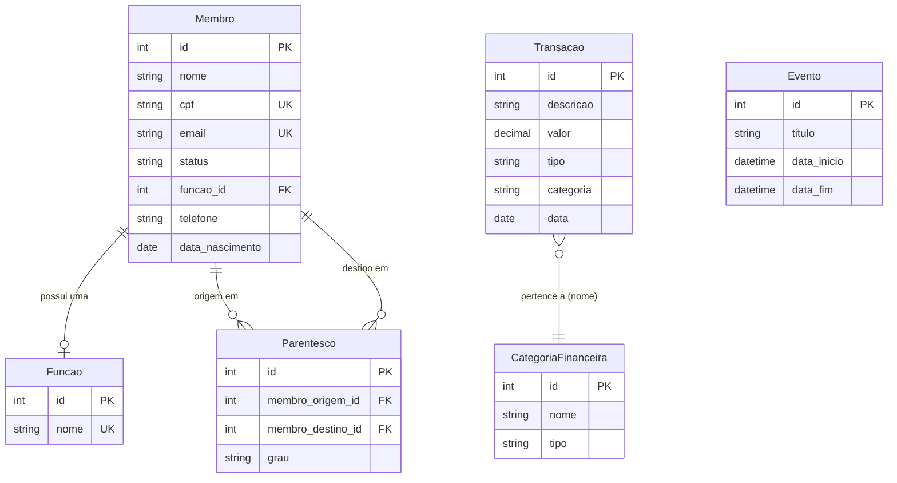

# 🏛️ Manual de Arquitetura - AD Capital

Este documento consolida todos os serviços e endereços que compõem o ecossistema digital da igreja.

### 📍 Localização dos Serviços

| Serviço | Provedor | Função | Acesso |
| :--- | :--- | :--- | :--- |
| **Domínio** | Registro.br | "Dono" do nome | [registro.br](https://registro.br) |
| **DNS & Segurança** | Cloudflare | "Torre de Comando" e Redirecionamentos | [dash.cloudflare.com](https://dash.cloudflare.com) |
| **Site/Sistema (Front)** | Render | Onde o visual do site funciona | [dashboard.render.com](https://dashboard.render.com) |
| **Banco/API (Back)** | Supabase | Onde os dados dos membros ficam permanentemente | [supabase.com](https://supabase.com) |
| **Fotos & Mídia** | Cloudinary | Armazena fotos dos membros e logos | [cloudinary.com](https://cloudinary.com) |
| **Código Fonte** | GitHub | Onde todo o código do projeto é salvo | [github.com](https://github.com) |
| **Estatísticas & BI** | Google | Monitoramento e conversões do site e portal | [analytics.google.com](https://analytics.google.com) |

### 🔗 Estrutura de Endereços (URLs)

| URL | Finalidade | Quem Acessa |
| :--- | :--- | :--- |
| `adcapitaligreja.com.br` | **Site Institucional** (Público) | Visitantes / Google |
| `sistema.adcapitaligreja.com.br` | **Painel Administrativo** | Secretários / Pastores |
| `cadastro.adcapitaligreja.com.br` | **Portal de Membros** | Novos Membros |
| `api.adcapitaligreja.com.br/admin` | **Django Admin (Manual)** | Superusuário / TI |
| `api.adcapitaligreja.com.br` | **Comunicação Interna** (Backend) | Invisível ao usuário |
| `sistema.adcapitaligreja.com.br/#/portal` | **Portal do Membro** (Auto-serviço) | Membros da Igreja |

---

### 🛠️ Fluxo de Funcionamento

1. **Desenvolvimento**: As alterações são feitas localmente.
2. **GitHub**: O código é enviado para o repositório seguro.
3. **Render**: Detecta a mudança no GitHub e atualiza o site automaticamente em minutos.
4. **Cloudflare**: Protege o site contra ataques e redireciona os domínios para os lugares certos.
5. **Cloudinary**: Garante que as fotos dos membros nunca sumam, mesmo que o servidor seja reiniciado.

---

### 🏛️ Modelo de Entidade-Relacionamento (MER)

Abaixo está o diagrama das principais tabelas que compõem o banco de dados no Supabase:


```mermaid
erDiagram
    Membro ||--o| Funcao : "possui uma"
    Membro ||--o{ Parentesco : "origem em"
    Membro ||--o{ Parentesco : "destino em"
    Transacao }o--|| CategoriaFinanceira : "pertence a (nome)"
    
    Membro {
        int id PK
        string nome
        string cpf UK
        string email UK
        string status
        int funcao_id FK
        string telefone
        date data_nascimento
    }
    
    Funcao {
        int id PK
        string nome UK
    }
    
    Parentesco {
        int id PK
        int membro_origem_id FK
        int membro_destino_id FK
        string grau
    }
    
    Transacao {
        int id PK
        string descricao
        decimal valor
        string tipo
        string categoria
        date data
    }

    CategoriaFinanceira {
        int id PK
        string nome
        string tipo
    }

    Evento {
        int id PK
        string titulo
        datetime data_inicio
        datetime data_fim
    }
```

---

### 🔐 Gestão de Acessos (RBAC)

O sistema implementa um controle de acesso rigoroso baseado em cargos:

| Nível de Acesso | Permissões Principais |
| :--- | :--- |
| **ADMIN** | Controle total do sistema, configurações e gestão de usuários. |
| **SECRETARIO** | Gestão completa de membros, geração de documentos (LGPD) e agenda. |
| **TESOUREIRO** | Gestão financeira, entradas/saídas e relatórios de caixa. |
| **MEMBRO** | Acesso exclusivo ao seu próprio perfil para atualização de dados cadastrais. |

**Segurança:** Todas as rotas da API são protegidas por tokens **JWT (JSON Web Token)** com validade de 24 horas, garantindo que apenas usuários autenticados acessem os dados.

---

### 👤 Portal do Membro (Auto-serviço)

Uma das maiores inovações do sistema é o portal onde o próprio membro gerencia sua ficha:
*   **Acesso Simplificado:** Login via CPF e senha pessoal.
*   **Atualização em Tempo Real:** O membro pode corrigir telefone, e-mail, endereço e cargo eclesiástico.
*   **Transparência:** Visualização de vínculos familiares e status de regularidade.

---

### ⏰ Keep-Alive (Prevenção de Inatividade)

Devido às limitações dos planos gratuitos utilizados:
1. **Render Free (API)**: Entra em modo de suspensão (*sleep*) após 15 minutos sem receber requisições, causando lentidão (*cold start*) no próximo acesso.
2. **Supabase Free (Banco de Dados)**: Pausa o projeto inteiro após 7 dias ininterruptos de inatividade.

**Solução Aplicada:**
Utilizamos o serviço externo **[cron-job.org](https://cron-job.org/en/)** (agendado **a cada 10 minutos**) para fazer requisições automatizadas na API pública (`https://api.adcapitaligreja.com.br/api/configuracao-site/`).
Isso mantém tanto o servidor da API "acordado" quanto o Banco de Dados "ativo", impedindo que os dados fiquem inacessíveis.

---

### 💾 Backup e Segurança de Dados

Para garantir que a igreja nunca perca seus dados, existe um script de exportação rápida que gera um arquivo formatado (JSON).

**Como realizar o backup:**
1. Abra o terminal na pasta raiz do projeto.
2. Execute o comando:
   ```powershell
   .\venv\Scripts\python.exe fast_backup.py
   ```
3. Um novo arquivo **`backup_adcapital.json`** será gerado.
4. **Recomendação**: Salve uma cópia deste arquivo em um local seguro (Google Drive, Pen Drive, etc) toda semana.

---

### 📊 Estatísticas e Rastreamento (Google Analytics 4)

O ecossistema digital possui uma integração robusta e customizada com o **Google Analytics 4 (GA4)** para rastrear o fluxo de visitas e interações cruciais.

**O que é monitorado:**
*   **Landing Page Pública**: Acessos à página inicial (`/`) e cliques de conversão no botão *"Portal do Membro"* no cabeçalho.
*   **Portal do Membro (Logado)**: Navegação interna pelas abas (Mensagens: `/portal/mensagens`, Agenda: `/portal/agenda`, Perfil: `/portal/perfil`).
*   **Painel Administrativo**: Acessos ao login (`/login`) e navegação pelas abas administrativas (Início, Membros, Financeiro, Agenda, Estatísticas, Configurações).

**Configuração de Produção:**
O ID de métrica é configurado de forma dinâmica no frontend via variável de ambiente:
*   `VITE_GA_MEASUREMENT_ID` (ID de Produção: `G-7KZ3C5J6TH`)

Para alterar a conta de recebimento, basta atualizar essa chave no painel do Render ou no arquivo `.env` do React.

---
*Manual de arquitetura - AD Capital Igreja*
